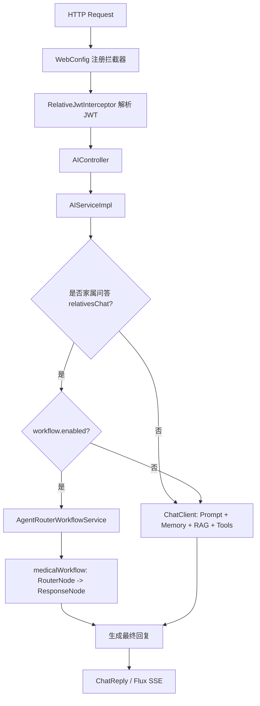

# SunnySide

本项目是基于 Spring AI和Spring AI Alibaba workflow 学习项目，核心目标是把 **RAG上下文检索、工具调用、会话记忆、workflow/Graph、登录态注入** 放到同一套业务链路里落地。
面向对象是医疗场景中的患者侧和家属侧智能问答，提供一个可运行的示例。

## 1. 当前能力

- 聊天问答：支持患者与家属侧问答
- 多轮记忆：基于 `ChatMemory` 管理会话上下文(将来肯定会扩展到使用专门的数据库来存储记忆)
- RAG 检索：启动时将本地知识写入 Qdrant向量数据库，并基于向量检索增强回答
- 工具调用：模型可调用住院业务工具（体征、诊疗计划、值班团队、饮食医嘱）
- 工作流：家属问答可按配置切到 Workflow（RouterNode -> ResponseNode）
- 流式输出：支持 SSE
- 多模态：支持 `image/*`、`audio/*`、`video/*` 输入(该接口是我当时学习多模态写的,可有可无)
- 登录鉴权：家属登录（验证码 + JWT），并通过拦截器注入登录上下文

## 2. 涉及技术

- Java 17
- Spring Boot 3.5.x
- Spring AI 1.1.x + Spring AI Alibaba
- MyBatis + MySQL
- Redis（验证码）
- Qdrant（向量库）
- DashScope（LLM）

## 3. 关键目录

```text
src/main/java/cn/lc/sunnyside
├── AITool/          # AI 可调用工具（InpatientMedicalTools）
├── Auth/            # JWT 拦截器与登录上下文
├── Config/          # Web、RAG 等配置
├── Controller/      # 接口入口（AI、Auth）
├── POJO/            # DO/DTO
├── Service/         # 业务服务与实现
├── Workflow/        # Workflow 节点、编排与执行门面
├── mapper/          # MyBatis Mapper 接口
└── SunnySideApplication.java

src/main/resources
├── application.yml
├── mapper/          # MyBatis XML
├── prompts/         # 系统提示词模板
└── rag/             # RAG 知识文件
```

## 4. 执行逻辑（Mermaid）

### 4.1 普通问答链路（患者/家属）



### 4.2 家属登录与上下文注入

```mermaid
sequenceDiagram
    规定 U   作为 用户
    规定 AC  作为 AuthController.java文件
    规定 AS  作为 RelativeAuthService.java文件
    规定 R   作为 Redis服务
    规定 AI  作为 AIController.java文件
    规定 RI  作为 RelativeJwtInterceptor.java文件
    规定 Ctx 作为 RelativeLoginContext.java文件

    U->>AC: GET /auth/relative/captcha          [自动发起获取验证码请求]
    AC->>AS: createCaptcha()                    [获取验证码]
    AS->>R: 存验证码(带TTL)                      [将验证码存储到Redis中]
    AS-->>U: captchaId + base64 图片

    U->>AC: POST /auth/relative/login           [用户发起登录请求]
    AC->>AS: login(account,password,captcha)    [输入账户,密码,验证码]
    AS->>R: 校验并删除验证码                      
    AS-->>U: JWT token

    U->>AI: 携带 Authorization 调用 AI 接口
    AI->>RI: preHandle()
    RI->>Ctx: 写入 relativeId/phone
    AI-->>U: 返回含登录态上下文增强的回复
```

## 5. 接口总览

### 5.1 认证接口

- `GET /auth/relative/captcha`：生成图形验证码
- `POST /auth/relative/login`：账号 + 密码 + 验证码登录，返回 JWT

### 5.2 AI 接口

- `GET /PatientChat?userInput=...&UserID=...`
- `GET /RelativesChat?userInput=...&UserID=...`
- `GET /stream?userInput=...&UserID=...`（SSE）
- `POST /chat/multimodal`（`multipart/form-data`，字段：`userInput`、`media`、`UserID`）
- `GET /api/workflow/medical-chat?query=...&phone=...`


## 6. RAG 加载机制

- 知识源：`src/main/resources/rag/ragKonloage.txt`
- 启动逻辑：`RAGConfig.loadData(...)`
- 增量策略：计算知识内容 SHA-256，与 `target/rag/ragKonloage.sha256` 比较
- 无变更：跳过重写向量
- 有变更：删除旧 `source_file=ragKonloage.txt` 文档后重建

## 7. 快速启动

### 7.1 先决条件

- JDK 17
- Maven
- MySQL（需创建 `sunnyside` 库）
- Redis
- Qdrant
- DashScope API Key

### 7.2 初始化数据库

执行 `sql.sql` 创建表结构。

### 7.3 关键环境变量

- `DB_USERNAME`
- `DB_PASSWORD`
- `REDIS_HOST`
- `REDIS_PORT`
- `QDRANT_HOST`
- `DASHSCOPE_API_KEY`
- `APP_JWT_SECRET`
- `APP_AI_WORKFLOW_ENABLED`

