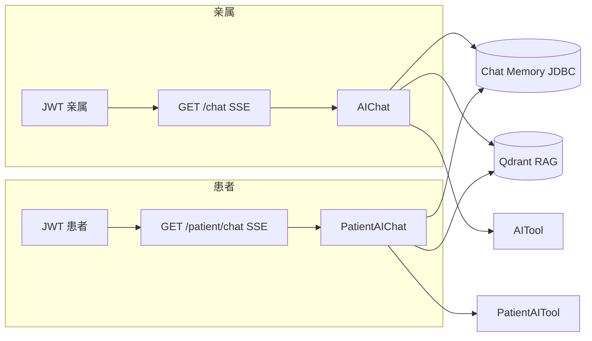

# SunnySide

基于 **Spring Boot** 与 **Spring AI** 的医疗陪护方向示例后端：将 **RAG 检索、工具调用、多轮会话记忆（JDBC 持久化）** 与住院业务数据结合，服务**亲属端**与**患者端**两类用户（JWT 鉴权、SSE 流式对话）。

项目仍在迭代；接口与行为以仓库内代码及 `docs/API.md` 为准。

---

## 功能概览

| 能力 | 说明 |
|------|------|
| 双端账户 | 亲属 `relative_user`、患者 `patient`：注册 / 登录，JWT（subject 为用户名） |
| 患者绑定 | 亲属搜索患者、建立绑定、列表与解绑（`/bindPatient/*`） |
| AI 对话 | 亲属 `GET /chat`、患者 `GET /patient/chat`，**SSE** 流式输出 |
| 会话记忆 | `MessageChatMemoryAdvisor` + `conversation_id`（请求参数 `timeId`），可落库 |
| RAG | Qdrant 向量库；启动时按配置对知识文件做增量灌库 |
| 工具调用 | 亲属侧 `AITool`、患者侧 `PatientAITool`，查询体征、治疗计划、值班、公告等住院数据 |
| 跨域 | `app.cors`（默认可配合本机前端开发） |

详细 HTTP 路径、请求体与鉴权约定见 **[docs/API.md](docs/API.md)**。

---

## 技术栈

- Java 17  
- Spring Boot 3.5.x  
- Spring AI 1.1.x（RAG、Chat Client、Qdrant Vector Store、Chat Memory JDBC）  
- 通义 DashScope（`spring-ai-alibaba-starter-dashscope`）  
- MyBatis + MySQL  
- Qdrant  

（`pom.xml` 中已引入 Spring Data Redis，当前默认 `application.yml` 未配置 Redis；若启用需自行补充连接信息。）

---

## 仓库结构（核心）

```text
src/main/java/com/example/project
├── SunnySideApplication.java
├── ai/
│   ├── client/          # AIChat（亲属）、PatientAIChat（患者）
│   ├── prompt/          # 系统提示词与模板
│   ├── rag/             # RAG 灌库与 Advisor 配置
│   └── tools/           # AITool、PatientAITool
├── config/              # CORS 等
├── controller/          # aiController、PatientChatController、relativeController、PatientController、BindPatientController
├── mapper/              # MyBatis 接口
├── pojo/                # 实体与 DTO/VO
├── security/            # JwtInterceptor、WebConfig（JWT 白名单）
└── service/             # 业务与 AI 数据聚合

src/main/resources
├── application.yml
├── mapper/              # MyBatis XML
├── prompt/              # *.st 提示模板
└── rag/                 # 知识文件（如 RAG.txt），灌库配置见下文
```

---

## 请求链路（简图）



---

## RAG 灌库（与运行相关）

- 知识文件默认位于 `src/main/resources/rag/RAG.txt`（文件名以 `application.yml` 中 `app.ai.rag-ingest.doc-key` 与实现为准）。  
- `app.ai.rag-ingest`：`enabled`、`force`（是否忽略增量状态强制重建）、`doc-key` 等，见 `RagIngestProperties` / `RagIngestService`。  
- 向量存储使用 Spring AI 的 Qdrant 配置（`spring.ai.vectorstore.qdrant.*`）。

---

## 快速开始

### 环境要求

- JDK 17、Maven  
- MySQL（创建库名如 `sunnyside`，与 JDBC URL 一致）  
- 可访问的 Qdrant  
- 通义 DashScope API Key（`spring.ai.dashscope.api-key`，**勿将真实密钥提交到公开仓库**）

### 数据库

1. 执行 [sql/sql.sql](sql/sql.sql) 初始化表结构。  
2. 可选：执行 [sql/seed_test_data.sql](sql/seed_test_data.sql) 导入测试数据。

### 配置

编辑 `src/main/resources/application.yml`：

- `spring.datasource.*`：数据库账号密码  
- `spring.ai.dashscope.api-key`：模型密钥  
- `spring.ai.vectorstore.qdrant.*`：Qdrant 地址与 collection  

Chat Memory 表由 `spring.ai.chat.memory.repository.jdbc.initialize-schema` 控制（默认常为 `always` 便于本地调试）。

### 运行

```bash
mvn spring-boot:run
```

默认端口见 `server.port`（常见为 `8080`）。对接前端请先阅读 [docs/API.md](docs/API.md)（含 SSE 与 `Authorization: Bearer` 说明）。

---

## 相关文档

- [docs/API.md](docs/API.md) — HTTP 接口与鉴权白名单  
- [postman/SunnySide.postman_collection.json](postman/SunnySide.postman_collection.json) — 可选 Postman 集合（若与代码不一致，以代码为准）

---

## 许可与说明

学习与实践用途为主；生产环境请单独加固密钥管理、HTTPS、限流与审计。
