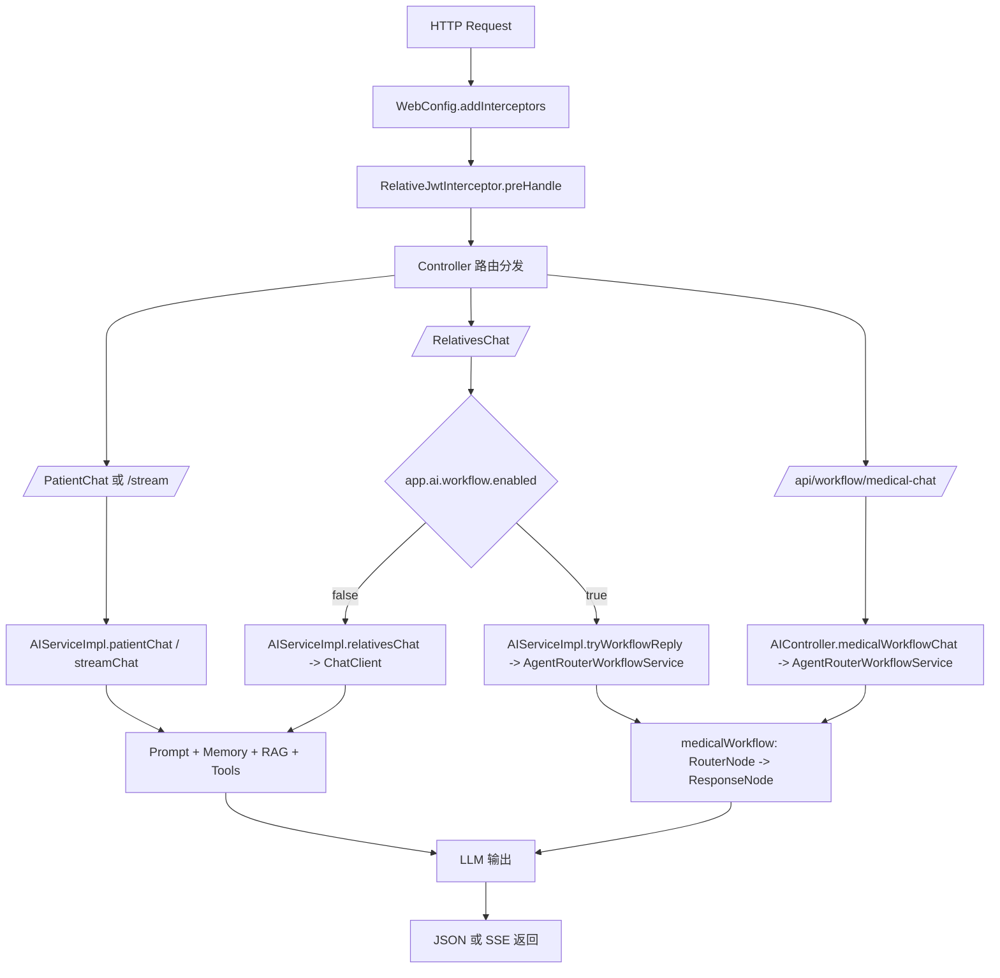
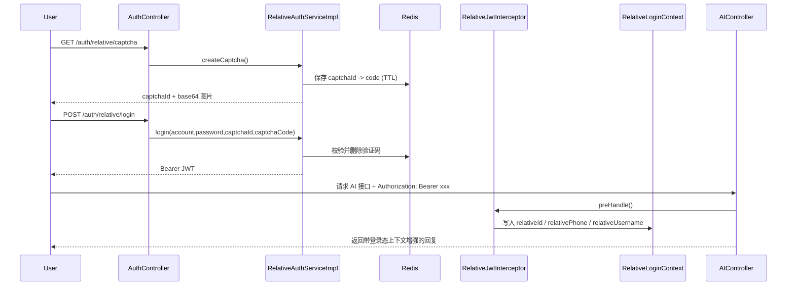
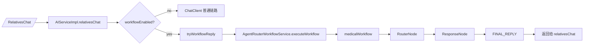

# SunnySide

本项目是基于 Spring AI和Spring AI Alibaba workflow 学习项目，核心目标是把 **RAG上下文检索、工具调用、会话记忆、workflow/Graph、登录态注入** 放到同一套业务链路里落地。
面向对象是医疗场景中的患者侧和家属侧智能问答，提供一个可运行的示例。

## 1. 当前能力

- 聊天问答：支持患者与家属侧问答
- 多轮记忆：基于 `ChatMemory` 管理会话上下文(将来肯定会扩展到使用专门的数据库来存储记忆)
- RAG 检索：启动时将本地知识写入 Qdrant向量数据库，并基于向量检索增强回答
- 工具调用：模型可调用住院业务工具（体征、诊疗计划、值班团队、饮食医嘱）
- 工作流：家属问答可按配置切到 Workflow（RouterNode -> ResponseNode）
- 流式输出：支持 SSE
- 多模态：支持 `image/*`、`audio/*`、`video/*` 输入(该接口是我当时学习多模态写的,可有可无)
- 登录鉴权：家属登录（验证码 + JWT），并通过拦截器注入登录上下文

## 2. 涉及技术

- Java 17
- Spring Boot 3.5.x
- Spring AI 1.1.x + Spring AI Alibaba
- MyBatis + MySQL
- Redis（验证码）
- Qdrant（向量库）
- DashScope（LLM）

## 3. 关键目录

```text
src/main/java/cn/lc/sunnyside
├── AITool/          # AI 可调用工具（InpatientMedicalTools）
├── Auth/            # JWT 拦截器与登录上下文
├── Config/          # Web、RAG 等配置
├── Controller/      # 接口入口（AI、Auth）
├── POJO/            # DO/DTO
├── Service/         # 业务服务与实现
├── Workflow/        # Workflow 节点、编排与执行门面
├── mapper/          # MyBatis Mapper 接口
└── SunnySideApplication.java

src/main/resources
├── application.yml
├── mapper/          # MyBatis XML
├── prompts/         # 系统提示词模板
└── rag/             # RAG 知识文件
```

## 4. 执行逻辑（按请求路径拆解）

### 4.1 请求总览



涉及文件：`src/main/java/cn/lc/sunnyside/Config/WebConfig.java`、`src/main/java/cn/lc/sunnyside/Auth/RelativeJwtInterceptor.java`、`src/main/java/cn/lc/sunnyside/Controller/AIController.java`

### 4.2 普通问答链路（Patient / Relatives / Stream）

1. `AIController` 接收请求并校验 `UserID`（会话 ID）。
2. `AIServiceImpl` 构建系统提示词（`buildSystemPrompt`），将登录态信息拼入 `family_context`。
3. `ChatClient` 默认挂载：
   - `MessageChatMemoryAdvisor`（多轮记忆）
   - `QuestionAnswerAdvisor`（向量检索增强）
4. 模型可调用 `InpatientMedicalTools` 获取业务数据。
5. `/stream` 走流式输出，其余接口返回 `ChatReplyRecord`。

涉及文件：`src/main/java/cn/lc/sunnyside/Controller/AIController.java`、`src/main/java/cn/lc/sunnyside/Service/ServiceImpl/AIServiceImpl.java`、`src/main/java/cn/lc/sunnyside/AITool/InpatientMedicalTools.java`

### 4.3 家属登录与上下文注入



涉及文件：`src/main/java/cn/lc/sunnyside/Controller/AuthController.java`、`src/main/java/cn/lc/sunnyside/Service/ServiceImpl/RelativeAuthServiceImpl.java`、`src/main/java/cn/lc/sunnyside/Auth/RelativeJwtInterceptor.java`、`src/main/java/cn/lc/sunnyside/Auth/RelativeLoginContext.java`

### 4.4 Workflow 分支（家属问答）



涉及文件：`src/main/java/cn/lc/sunnyside/Service/ServiceImpl/AIServiceImpl.java`、`src/main/java/cn/lc/sunnyside/Workflow/AgentRouterWorkflowService.java`、`src/main/java/cn/lc/sunnyside/Workflow/SunnySideWorkflowConfig.java`

### 4.5 关键文件与作用

| 文件 | 关键符号 | 作用 |
|---|---|---|
| `src/main/java/cn/lc/sunnyside/Controller/AIController.java` | `patientChat` `relativesChat` `streamChat` `medicalWorkflowChat` | AI 接口统一入口，参数校验与路由分发。 |
| `src/main/java/cn/lc/sunnyside/Service/ServiceImpl/AIServiceImpl.java` | `buildSystemPrompt` `tryWorkflowReply` | 编排 Prompt、Memory、RAG、Tools，并按开关切换 Workflow。 |
| `src/main/java/cn/lc/sunnyside/Auth/RelativeJwtInterceptor.java` | `preHandle` | 解析 Bearer JWT，并将亲属身份写入请求上下文。 |
| `src/main/java/cn/lc/sunnyside/Auth/RelativeLoginContext.java` | `set/get/clear` | 存放当前请求的亲属登录态（ThreadLocal）。 |
| `src/main/java/cn/lc/sunnyside/Controller/AuthController.java` | `captcha` `login` | 提供验证码生成与登录接口。 |
| `src/main/java/cn/lc/sunnyside/Service/ServiceImpl/RelativeAuthServiceImpl.java` | `createCaptcha` `login` | 验证码存取 Redis、账号校验、签发 JWT。 |
| `src/main/java/cn/lc/sunnyside/Config/RAGConfig.java` | `loadData` | 启动时加载知识文件，按 SHA-256 判断是否重建向量。 |
| `src/main/java/cn/lc/sunnyside/AITool/InpatientMedicalTools.java` | Tool methods | 提供住院业务查询工具给模型调用。 |
| `src/main/java/cn/lc/sunnyside/Workflow/AgentRouterWorkflowService.java` | `executeWorkflow` | 组装工作流输入（query/phone/patientId）并执行图。 |
| `src/main/resources/application.yml` | `app.ai.workflow.enabled` 等 | 控制鉴权、验证码、RAG、Workflow 等运行参数。 |

### 4.6 配置开关如何影响链路

- `app.ai.workflow.enabled=false`：`/RelativesChat` 使用普通 ChatClient 链路。
- `app.ai.workflow.enabled=true`：`/RelativesChat` 优先走 `tryWorkflowReply -> executeWorkflow`。
- `app.auth.jwt.secret` 为空：JWT 拦截器不做验签，登录态不会注入上下文。
- `app.auth.captcha.*`：控制验证码尺寸、TTL、key 前缀。
- `app.rag.force-reload=true`：忽略 hash 缓存，启动时强制重建向量。

### 4.7 常见排错点（和执行逻辑强相关）

- 登录报“账号、密码和验证码不能为空”：检查 `login` 请求体是否包含 `account`、`password`、`captchaId`、`captchaCode`。
- 能登录但 Workflow 无法识别亲属：检查请求头是否带 `Authorization: Bearer <token>`。
- RAG 没生效：确认 `ragKonloage.txt` 内容是否变更、Qdrant 是否可用、`force-reload` 配置是否符合预期。
- `/RelativesChat` 没走 Workflow：确认 `app.ai.workflow.enabled` 是否开启。

## 5. 接口总览

### 5.1 认证接口

- `GET /auth/relative/captcha`：生成图形验证码
- `POST /auth/relative/login`：账号 + 密码 + 验证码登录，返回 JWT

### 5.2 AI 接口

- `GET /PatientChat?userInput=...&UserID=...`
- `GET /RelativesChat?userInput=...&UserID=...`
- `GET /stream?userInput=...&UserID=...`（SSE）
- `POST /chat/multimodal`（`multipart/form-data`，字段：`userInput`、`media`、`UserID`）
- `GET /api/workflow/medical-chat?query=...&phone=...`


## 6. RAG 加载机制

- 知识源：`src/main/resources/rag/ragKonloage.txt`
- 启动逻辑：`RAGConfig.loadData(...)`
- 增量策略：计算知识内容 SHA-256，与 `target/rag/ragKonloage.sha256` 比较
- 无变更：跳过重写向量
- 有变更：删除旧 `source_file=ragKonloage.txt` 文档后重建

## 7. 快速启动

### 7.1 先决条件

- JDK 17
- Maven
- MySQL（需创建 `sunnyside` 库）
- Redis
- Qdrant
- DashScope API Key

### 7.2 初始化数据库

执行 `sql.sql` 创建表结构。

### 7.3 关键环境变量

- `DB_USERNAME`
- `DB_PASSWORD`
- `REDIS_HOST`
- `REDIS_PORT`
- `QDRANT_HOST`
- `DASHSCOPE_API_KEY`
- `APP_JWT_SECRET`
- `APP_AI_WORKFLOW_ENABLED`
