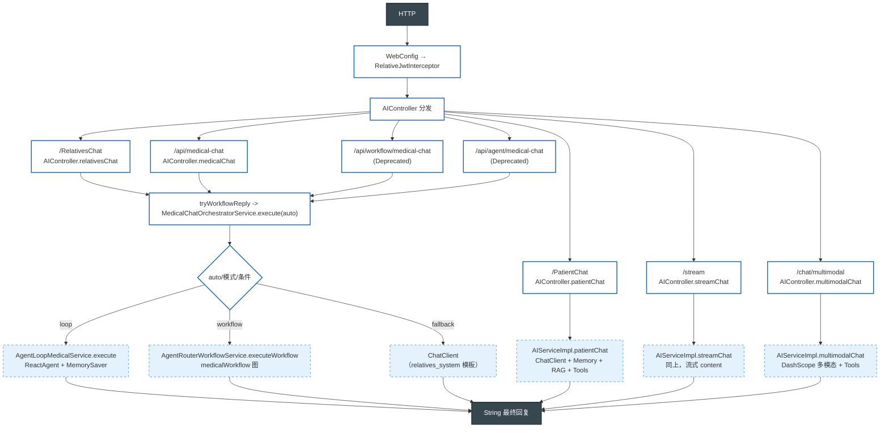
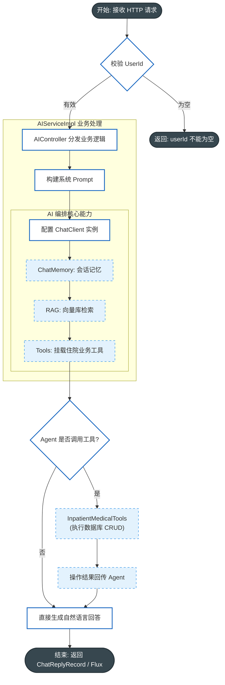
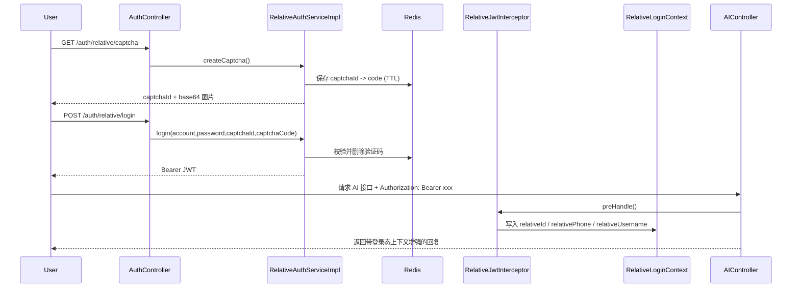
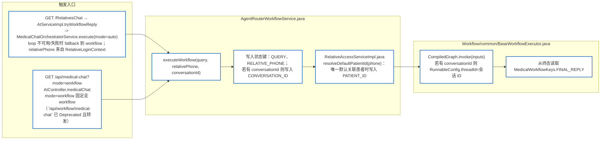
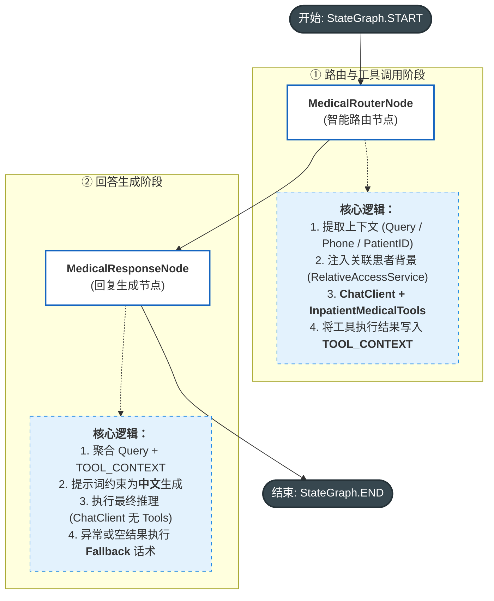

# 项目简介

本项目是一个基于 **Spring AI** 与 **Spring AI Alibaba Workflow** 的深度学习项目,目的是将传统的JAVA项目向Agent靠拢即:尝试将 **RAG上下文检索、工具调用、会话记忆、workflow/Graph、多模态等Agent功能** 放到同一套业务链路里落地。本项目以**医疗陪护**为切入点，针对住院病人及家属由于各种客观原因无法实时看护的痛点，提供了以下场景化功能：

* **家属远程感知：** 家属通过自然语言询问，Agent 自动调取病患实时体征指标并进行语义化解读。
* **病患极简交互：** 病人只需“一句话”即可完成复杂的医疗操作（如报餐、呼叫服务、查询治疗计划等）

本项目旨在探索 Java 与 Agent 的融合实践，目前项目仍处于迭代期，如遇 Bug 或逻辑疑问，欢迎随时反馈。最后,希望项目对各位有所帮助!

## 1. 当前能力

- 聊天问答：支持患者与家属侧问答
- 多轮记忆：基于 `ChatMemory` 管理会话上下文(将来肯定会扩展到使用专门的数据库来存储记忆)
- RAG 检索：启动时将本地知识写入 Qdrant向量数据库，并基于向量检索增强回答
- 工具调用：模型可调用住院业务工具（体征、诊疗计划、值班团队、饮食医嘱）
- 工作流：家属问答可按配置切到 Workflow（RouterNode -> ResponseNode）
- **医疗对话（推荐统一入口）**：`GET /api/medical-chat` 使用 `MedicalChatOrchestratorService` 统一编排医疗对话；默认 `mode=auto` 优先 Agent Loop（`ReactAgent.call`，Graph 上 Model/Tool 显式循环 + `ModelCallLimitHook` 迭代上限 + `MemorySaver` 按 `UserID` 作为 `threadId`），再按需 fallback 到 Workflow（`StateGraph`：router -> response）。旧接口 `GET /api/agent/medical-chat`、`GET /api/workflow/medical-chat` 已 `@Deprecated` 仅用于学习/灰度对比。Agent Loop 首版未接入与 `QuestionAnswerAdvisor` 等价的 RAG。配置项：`app.ai.agent-loop.enabled`、`app.ai.agent-loop.max-model-calls`。说明见 [Agents 教程](https://java2ai.com/docs/frameworks/agent-framework/tutorials/agents)。
- 流式输出：支持 SSE
- 多模态：支持 `image/*`、`audio/*`、`video/*` 输入(该接口是我当时学习多模态写的,可有可无)
- 登录鉴权：家属登录（验证码 + JWT），并通过拦截器注入登录上下文

## 2. 涉及技术

- Java 17
- Spring Boot 3.5.x
- Spring AI 1.1.x + Spring AI Alibaba
- MyBatis + MySQL
- Redis（验证码）
- Qdrant（向量库）
- DashScope（LLM）

## 3. 关键目录

```text
src/main/java/cn/lc/sunnyside
├── AITool/          # AI 可调用工具（InpatientMedicalTools）
├── Auth/            # JWT 拦截器与登录上下文
├── Config/          # Web、RAG 等配置
├── Controller/      # 接口入口（AI、Auth）
├── POJO/            # DO/DTO
├── Service/         # 业务服务与实现
├── agent/           # ReactAgent Loop：提示词、调用上下文、拦截器
├── Workflow/        # Workflow 节点、编排与执行门面
├── mapper/          # MyBatis Mapper 接口
└── SunnySideApplication.java

src/main/resources
├── application.yml
├── mapper/          # MyBatis XML
├── prompts/         # 系统提示词模板
└── rag/             # RAG 知识文件
```

## 4. 执行逻辑（按请求路径拆解）


### 4.2 请求总览（能力汇总）



涉及文件：`Config/WebConfig.java`、`Auth/RelativeJwtInterceptor.java`、`Controller/AIController.java`、`Service/ServiceImpl/AIServiceImpl.java`、`Workflow/AgentRouterWorkflowService.java`

### 4.3 普通问答链路（Patient / Relatives / Stream）



涉及文件：`Controller/AIController.java`、`Service/ServiceImpl/AIServiceImpl.java`、`AITool/InpatientMedicalTools.java`

### 4.4 家属登录与上下文注入



涉及文件：`Controller/AuthController.java`、`Service/ServiceImpl/RelativeAuthServiceImpl.java`、`Auth/RelativeJwtInterceptor.java`、`Auth/RelativeLoginContext.java`

### 4.5 Spring AI Alibaba Graph：`medicalWorkflow` 全链路

业务上使用的图由 **`SunnySideWorkflowConfig.java`** 注册为 Bean `medicalWorkflow`：`START → routerNode → responseNode → END`（Spring AI Alibaba 的 `StateGraph` / `CompiledGraph`）。HTTP 侧由 **`AgentRouterWorkflowService.java`** 执行该图。

#### 4.5.1 谁触发工作流、输入里有什么



若 `invoke` 异常或 `FINAL_REPLY` 为空，`executeWorkflow` 返回空字符串；`MedicalChatOrchestratorService` 会视为工作流未产出有效结果，**回退**到普通 `ChatClient`（Memory + RAG + Tools）。

#### 4.5.2 图内节点（对应 Java 文件与行为）

图结构在启动期由 `SunnySideWorkflowConfig.java` 定义，经 `Workflow/common/WorkflowGraphSupport.java` 编译为 `CompiledGraph`；下图仅描述**一次 invoke 的运行时顺序**。



**状态键约定**（便于对照代码）：`Workflow/common/MedicalWorkflowKeys.java`、`Workflow/common/WorkflowStateKeys.java`。

### 4.6 关键文件与作用

| 文件 | 关键符号 | 作用 |
|---|---|---|
| `src/main/java/cn/lc/sunnyside/Controller/AIController.java` | `patientChat` `relativesChat` `streamChat` `medicalWorkflowChat` | AI 接口统一入口，参数校验与路由分发。 |
| `src/main/java/cn/lc/sunnyside/Service/ServiceImpl/AIServiceImpl.java` | `buildSystemPrompt` `tryWorkflowReply` | 编排 Prompt、Memory、RAG、Tools，并按开关切换 Workflow。 |
| `src/main/java/cn/lc/sunnyside/Auth/RelativeJwtInterceptor.java` | `preHandle` | 解析 Bearer JWT，并将亲属身份写入请求上下文。 |
| `src/main/java/cn/lc/sunnyside/Auth/RelativeLoginContext.java` | `set/get/clear` | 存放当前请求的亲属登录态（ThreadLocal）。 |
| `src/main/java/cn/lc/sunnyside/Controller/AuthController.java` | `captcha` `login` | 提供验证码生成与登录接口。 |
| `src/main/java/cn/lc/sunnyside/Service/ServiceImpl/RelativeAuthServiceImpl.java` | `createCaptcha` `login` | 验证码存取 Redis、账号校验、签发 JWT。 |
| `src/main/java/cn/lc/sunnyside/Config/RAGConfig.java` | `loadData` | 启动时加载知识文件，按 SHA-256 判断是否重建向量。 |
| `src/main/java/cn/lc/sunnyside/AITool/InpatientMedicalTools.java` | Tool methods | 提供住院业务查询工具给模型调用。 |
| `src/main/java/cn/lc/sunnyside/Workflow/AgentRouterWorkflowService.java` | `executeWorkflow` | 组装工作流输入（query/phone/patientId）并委托基类执行 `medicalWorkflow`。 |
| `src/main/java/cn/lc/sunnyside/Workflow/common/BaseWorkflowExecutor.java` | `executeWorkflow(..., threadId)` | 调用 `CompiledGraph.invoke`，可选 `RunnableConfig.threadId`，读取 `FINAL_REPLY`。 |
| `src/main/java/cn/lc/sunnyside/Workflow/SunnySideWorkflowConfig.java` | `medicalWorkflow` Bean | 定义 `StateGraph` 边：`START → routerNode → responseNode → END`。 |
| `src/main/java/cn/lc/sunnyside/Workflow/common/WorkflowGraphSupport.java` | `compile` | 将 `StateGraph` 编译为可 `invoke` 的 `CompiledGraph`。 |
| `src/main/java/cn/lc/sunnyside/Workflow/MedicalRouterNode.java` | `apply` | 路由节点：LLM + `InpatientMedicalTools`，产出 `TOOL_CONTEXT`。 |
| `src/main/java/cn/lc/sunnyside/Workflow/MedicalResponseNode.java` | `apply` | 响应节点：根据工具上下文生成最终答复，写入 `FINAL_REPLY`。 |
| `src/main/java/cn/lc/sunnyside/Service/ServiceImpl/RelativeAccessServiceImpl.java` | `resolveDefaultPatientId` `buildBoundPatientContext` | 工作流与普通聊天共用：解析默认患者、拼接亲属绑定患者说明。 |
| `src/main/java/cn/lc/sunnyside/Config/WebConfig.java` | `addInterceptors` | 注册 `RelativeJwtInterceptor` 于 `/**`。 |
| `src/main/resources/application.yml` | `app.ai.workflow.enabled` 等 | 控制鉴权、验证码、RAG、Workflow 等运行参数。 |

### 4.7 配置开关如何影响链路

- `app.ai.workflow.enabled`：不再是 `/RelativesChat` 的主链路开关；目前 `/RelativesChat` 由 `MedicalChatOrchestratorService` 统一编排（`mode=auto`：loop 失败时 fallback 到 workflow，再不行回退到 ChatClient）。
- `app.auth.jwt.secret` 为空：JWT 拦截器不做验签，登录态不会注入上下文。
- `app.auth.captcha.*`：控制验证码尺寸、TTL、key 前缀。
- `app.rag.force-reload=true`：忽略 hash 缓存，启动时强制重建向量。

### 4.8 常见排错点（和执行逻辑强相关）

- 登录报“账号、密码和验证码不能为空”：检查 `login` 请求体是否包含 `account`、`password`、`captchaId`、`captchaCode`。
- 能登录但 Workflow 无法识别亲属：检查请求头是否带 `Authorization: Bearer <token>`。
- RAG 没生效：确认 `ragKonloage.txt` 内容是否变更、Qdrant 是否可用、`force-reload` 配置是否符合预期。
- `/RelativesChat` 没走 Workflow：如果当前为 `mode=auto`，需要检查 loop（`app.ai.agent-loop.enabled`）是否可用，以及请求中 `UserID` 是否存在（用于 threadId）；若 loop 失败后 workflow 仍返回空，则会回退到 ChatClient。
- loop/ workflow 都失败时仍像普通聊天：编排器在 loop 或 workflow 返回空/失败后，会回退到 ChatClient；可检查日志或断点 `MedicalChatOrchestratorService`、`AgentRouterWorkflowService` / `BaseWorkflowExecutor`。

## 5. 接口总览

### 5.1 认证接口

- `GET /auth/relative/captcha`：生成图形验证码
- `POST /auth/relative/login`：账号 + 密码 + 验证码登录，返回 JWT

### 5.2 AI 接口

- `GET /PatientChat?userInput=...&UserID=...`
- `GET /RelativesChat?userInput=...&UserID=...`
- `GET /stream?userInput=...&UserID=...`（SSE）
- `POST /chat/multimodal`（`multipart/form-data`，字段：`userInput`、`media`、`UserID`）
- `GET /api/medical-chat?query=...&phone=...&UserID=...&mode=auto|loop|workflow`
- `GET /api/workflow/medical-chat?query=...&phone=...`（Deprecated，已转发到 `/api/medical-chat?mode=workflow`）
- `GET /api/agent/medical-chat?query=...&phone=...&UserID=...`（Deprecated，已转发到 `/api/medical-chat?mode=loop`）


## 6. RAG 加载机制

- 知识源：`src/main/resources/rag/ragKonloage.txt`
- 启动逻辑：`RAGConfig.loadData(...)`
- 增量策略：计算知识内容 SHA-256，与 `target/rag/ragKonloage.sha256` 比较
- 无变更：跳过重写向量
- 有变更：删除旧 `source_file=ragKonloage.txt` 文档后重建

## 7. 快速启动

### 7.1 先决条件

- JDK 17
- Maven
- MySQL（需创建 `sunnyside` 库）
- Redis
- Qdrant
- DashScope API Key

### 7.2 初始化数据库

执行 `sql.sql` 创建表结构。

### 7.3 关键环境变量

- `DB_USERNAME`
- `DB_PASSWORD`
- `REDIS_HOST`
- `REDIS_PORT`
- `QDRANT_HOST`
- `DASHSCOPE_API_KEY`
- `APP_JWT_SECRET`
- `APP_AI_WORKFLOW_ENABLED`
